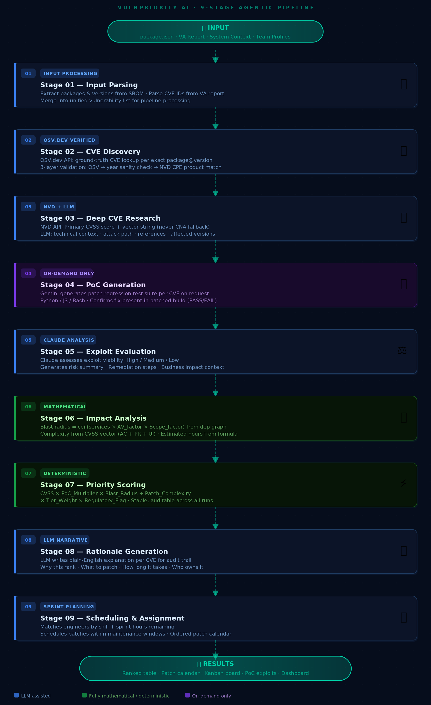

<div align="center">


# VulnPriority AI

### Agentic Vulnerability Prioritization for Enterprise Security Teams

[](https://vulnpriority-ai.onrender.com)
[](https://python.org)
[](https://fastapi.tiangolo.com)
[](https://reactjs.org)
[](LICENSE)

**Built for the 2026 Agentic AI Hackathon**

*Autonomously reviews CVEs, ranks upgrade urgency, and generates patch-verification tests - so security teams patch what matters first.*

</div>

---

## Overview

Large enterprises run dozens of interconnected applications. Each month, vendors release hundreds of patches. Security teams face an impossible choice: patch everything and risk downtime, or patch selectively and risk exposure.

**VulnPriority AI** solves this by running a 9-stage agentic pipeline that:

- Discovers CVEs from your SBOM against ground-truth databases (OSV.dev + NVD)
- Scores each vulnerability using a **deterministic, auditable formula** — no black-box AI rankings
- Calculates blast radius mathematically from your dependency graph
- Generates patch regression tests on-demand via Gemini
- Assigns patches to engineers based on sprint capacity and expertise
- Schedules patches within your maintenance windows

The result: a ranked patch calendar your team can act on immediately.

---

## Live Demo

> **[https://vulnpriority-ai.onrender.com](https://vulnpriority-ai.onrender.com)**

Load the enterprise test dataset from `test_dataset_enterprise_2026/` and run the full pipeline in under 2 minutes.

---

## The 9-Stage Pipeline



> 🟦 LLM-assisted &nbsp;&nbsp; 🟩 Fully mathematical/deterministic &nbsp;&nbsp; 🟪 On-demand only

---

## Scoring Formula

Every CVE receives a **deterministic priority score** computed from verified data sources — not LLM opinion. Rankings are stable across repeated runs.

```
Priority Score = CVSS × PoC_Multiplier × Blast_Radius
                 ─────────────────────────────────────  × Tier_Weight × Regulatory_Flag
                          Patch_Complexity
```

| Factor | Source | Values |
|---|---|---|
| **CVSS** | NVD Primary score only (never CNA fallback) | 0.0 – 10.0 |
| **PoC Multiplier** | From exploit viability evaluation | ×3.0 active · ×1.5 medium · ×1.0 none |
| **Blast Radius** | `ceil(services × AV_factor × Scope_factor)` from dependency graph | 1 – 10 |
| **Patch Complexity** | Derived from CVSS vector AC + PR + UI fields | 1 – 5 |
| **Tier Weight** | System criticality tier | Critical ×3.0 · Important ×2.0 · Standard ×1.0 |
| **Regulatory Flag** | PCI / SOX / HIPAA / GDPR / FedRAMP exposure | ×2.0 if present |

### Anti-Hallucination: 3-Layer CVE Validation

The pipeline prevents LLM-hallucinated CVEs (e.g., assigning a 1999 Windows CVE to an npm package) through three sequential guards:

1. **OSV.dev ground truth** — only returns CVEs confirmed for exact `package@version`
2. **Year sanity check** — npm CVEs must be ≥ 2010 (npm didn't exist in 1999)
3. **NVD CPE product match** — CVE CPE field must match the package name (character boundary check)

---

## Features

### Results Views
- **Ranked Vulnerability Table** — CVEs ordered by priority score with expandable detail rows
- **Patch Calendar** — Patches scheduled within maintenance windows, assigned to engineers
- **Kanban Board** — Sprint-style tickets across Backlog / In Progress / Complete lanes
- **On-Demand PoC** — Click per CVE to generate a patch regression test (Python / JS / Bash)
- **Dashboard** — Risk score delta, effort distribution, top engineer workload

### Data Sources
- **OSV.dev** — Ground-truth CVE ↔ package mapping (no hallucination)
- **NVD API** — CVSS v3.1 Primary scores and vector strings (never CNA fallback)
- **Gemini** — CVE research, rationale, PoC generation (`gemini-2.0-flash`)
- **Claude** — Exploit evaluation, structured output, risk summaries

### Enterprise Inputs
Upload JSON files directly from `test_dataset_enterprise_2026/`:

| File | Purpose |
|---|---|
| `package.json` | SBOM — all packages and versions to scan |
| `va_report_q2_2026.txt` | VA/pentest report — CVE IDs extracted automatically |
| `system_info.json` | System name, tier, regulatory scope, dependencies |
| `team_profiles.json` | Engineer skills, sprint hours, availability |
| `maintenance_windows.json` | Scheduled downtime windows for patch deployment |
| `vendor_advisories.json` | Vendor patch notices and affected packages |
| `internal_docs.json` | Internal threat notes and architecture context |
| `dependency_graph.json` | Service dependency edges for blast radius calculation |

---

## Tech Stack

| Layer | Technology |
|---|---|
| **Backend** | Python 3.11, FastAPI, Server-Sent Events (SSE streaming) |
| **Frontend** | React 18 (CDN, no build step), Highlight.js |
| **AI — Research** | Google Gemini (`gemini-2.0-flash`) via `google-genai` SDK |
| **AI — Evaluation** | Anthropic Claude (`claude-opus-4-5`) via `anthropic` SDK |
| **CVE Data** | OSV.dev API, NVD REST API v2 |
| **Database** | SQLite (scan history, team profiles, config persistence) |
| **Deployment** | Render (Python web service, static files served by FastAPI) |

---

## Local Setup

### Prerequisites
- Python 3.11+
- A Gemini API key and/or Anthropic API key

### 1. Clone the repo

```bash
git clone https://github.com/Lord2709/WhiteHat.git
cd WhiteHat
```

### 2. Install backend dependencies

```bash
cd backend
pip install -r requirements.txt
```

### 3. Configure API keys

Create `backend/.env`:

```env
GEMINI_API_KEY=AIza...
ANTHROPIC_API_KEY=sk-ant-...
NVD_API_KEY=your-nvd-key        # optional but recommended
```

> Get a free NVD API key at [nvd.nist.gov/developers/request-an-api-key](https://nvd.nist.gov/developers/request-an-api-key). Without it, NVD rate-limits to 5 requests/30 seconds, causing `NVD PENDING` scores on large scans.

### 4. Start the backend

```bash
cd backend
uvicorn main:app --reload --port 8000
```

### 5. Open the frontend

Open `frontend/index.html` directly in your browser — no build step required.

Or navigate to [http://localhost:8000](http://localhost:8000) (FastAPI also serves the frontend).

---

## Running a Scan

### Quick start with test dataset

1. Open the **Configure** page
2. Upload `test_dataset_enterprise_2026/package.json` in the SBOM section
3. Upload `test_dataset_enterprise_2026/va_report_q2_2026.txt` in the VA Report section
4. Upload the remaining 6 JSON files in their respective sections
5. Click **Run Agentic Analysis**

The pipeline streams progress in real time (~90 seconds with both API keys). Results appear automatically when complete.

### What the test dataset represents

The `test_dataset_enterprise_2026/` directory simulates a real enterprise environment:

- **NorthStar Payments** — a fictional payment processing company
- **System**: `payment-api` (critical tier, PCI + GDPR + SOX)
- **7 downstream services**: auth, settlement-worker, fraud-scoring, merchant-portal, reporting, redis, postgres
- **Team**: 4 engineers with varying skills and sprint capacities
- **Maintenance windows**: Sunday 01:30 and Wednesday 23:00

---

## Project Structure

```
WhiteHat/
├── backend/
│   ├── main.py              # FastAPI app — all pipeline logic, 2800+ lines
│   ├── config.py            # Environment variable loading
│   ├── connectors.py        # Vendor advisory / internal doc connectors
│   ├── db.py                # SQLite: scan history, team profiles, config
│   ├── schemas.py           # Pydantic request/response models
│   ├── requirements.txt
│   └── .python-version      # Pins Python 3.11.9 for Render
│
├── frontend/
│   ├── index.html           # CSS + script tags (no build required)
│   └── js/
│       ├── app-shared.js    # Shared state, API_URL, helpers
│       ├── app.js           # Root App component, pipeline SSE handler
│       └── pages/
│           ├── configure-page.js   # File uploads, system config
│           ├── pipeline-page.js    # Live progress + results tabs
│           ├── results-page.js     # Ranked table, dashboard
│           └── team-page.js        # Engineer profile management
│
├── test_dataset_enterprise_2026/   # Ready-to-use enterprise scenario
│   ├── package.json
│   ├── va_report_q2_2026.txt
│   ├── system_info.json
│   ├── team_profiles.json
│   ├── maintenance_windows.json
│   ├── vendor_advisories.json
│   ├── internal_docs.json
│   └── dependency_graph.json
│
├── render.yaml              # One-click Render deployment config
├── START.md                 # Quick start guide
└── LICENSE                  # MIT
```

---

## Deployment (Render)

The repo includes a `render.yaml` for one-click deployment.

### Steps

1. Fork or push this repo to your GitHub account
2. Go to [dashboard.render.com](https://dashboard.render.com) → **New → Web Service**
3. Connect your GitHub repo
4. Set these fields:

| Field | Value |
|---|---|
| Root Directory | `backend` |
| Build Command | `pip install -r requirements.txt` |
| Start Command | `uvicorn main:app --host 0.0.0.0 --port $PORT` |

5. Add environment variables: `GEMINI_API_KEY`, `ANTHROPIC_API_KEY`, `NVD_API_KEY`
6. Deploy

The frontend is served directly by FastAPI from `../frontend` — no separate static hosting needed.

> **Free tier note:** Render's free plan sleeps after 15 minutes of inactivity. The first request after sleep takes ~30 seconds. Upgrade to Starter ($7/mo) for always-on uptime during demos.

---

## API Reference

The backend exposes a REST + SSE API:

| Endpoint | Method | Description |
|---|---|---|
| `/health` | GET | Service health check |
| `/api/analyze` | POST | Run full pipeline (SSE stream) |
| `/api/generate-exploit` | POST | On-demand PoC for a single CVE |
| `/api/upload-report` | POST | Upload VA report, extract CVE IDs |
| `/api/parse-config-nl` | POST | Natural language → system config |
| `/api/config/save` | POST | Persist configuration to DB |
| `/api/config/load` | GET | Load saved configuration |
| `/api/scans` | GET / POST / DELETE | Scan history management |
| `/api/scans/{id}` | GET | Load a specific saved scan |
| `/api/team-profiles` | GET / POST | Team profile management |
| `/api/env-status` | GET | Which API keys are loaded server-side |
| `/api/sample-input` | GET | Load built-in demo dataset |

---

## Hackathon Context

Built for the **2026 Agentic AI Hackathon**:

> *Design an Agentic AI system that autonomously reviews vulnerability reports (CVEs, vendor advisories), internal system documentation, and dependency maps to prioritize software upgrades. The agent should assess business impact, technical risk, and upgrade complexity, then produce a ranked upgrade plan that minimizes overall security risk while reducing disruption to mission-critical systems.*

### How this solution addresses the brief

| Requirement | Implementation |
|---|---|
| Review CVEs autonomously | OSV.dev + NVD API lookup per package@version |
| Process vendor advisories | `vendor_advisories.json` connector input |
| Use internal documentation | `internal_docs.json` enriches CVE matching |
| Map dependencies | `dependency_graph.json` drives blast radius |
| Assess business impact | Tier weight × regulatory flag multipliers |
| Assess technical risk | NVD CVSS × exploit viability × PoC multiplier |
| Assess upgrade complexity | CVSS vector fields (AC + PR + UI) → 1–5 scale |
| Produce a ranked plan | Deterministic priority score, stable across runs |
| Minimize disruption | Maintenance window scheduling + sprint capacity |

---

## License

[MIT License](LICENSE) — Copyright 2026
